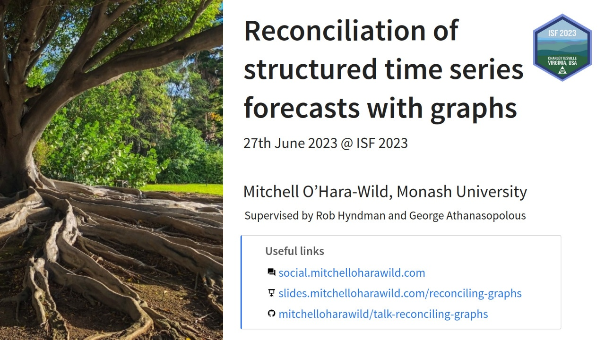

<!-- README.md is generated from README.Rmd. Please edit that file -->

# ISF2023: Reconciliation of structured time series forecasts with graphs

<!-- badges: start -->
<!-- badges: end -->

Slides and notes for a talk at the 43rd International Symposium on
Forecasting (25-28th June 2023) in Charlottesville, Virginia USA.

A recording of this presentation is available on YouTube here:
<https://www.youtube.com/watch?v=FBM-nEbeHTw>

#### Abstract

Large collections of time series are often constrained to be coherent;
for example, national forecasts should equal the sum of state forecasts.
Forecast reconciliation algorithms enforce these constraints onto
forecasts of these series. Hierarchical constraints are typically
visualised with polytrees, where each series is represented by a node
and edges connect series to their disaggregated child series. Grouped
constraints are often shown as multiple disjoint polytrees, with each
polytree showing a different order of disaggregation by the grouping
variables. On the other hand, forecast reconciliation computation is
typically done using matrix algebra, where matrices are used to encode
the linear constraints.

I propose using directed acyclical graphs (DAGs) to both visualise the
constraints, and to facilitate forecast reconciliation computation.
Using DAGs to represent the structure of a coherent collection of time
series enables more flexible reconciliation structures than those
possible in hierarchical and grouped designs. Graph structures can
represent partial reconciliation via disjoint graphs, remove redundant
aggregation with unbalanced trees, and allow sparse aggregation
constraints from different levels of disaggregated series. Utilising a
graph structure to describe the coherency of a time series also enables
improved interfaces for analysing specific areas of a hierarchy.

This talk will discuss how graphs can be used to represent a wide
variety of coherent time series structures and demonstrate the
advantages of using them in data exploration and forecast
reconciliation.

#### Structure

- The basics of reconciliation
- Hierarchical coherence
- Grouped coherence
- Graph coherence
- Disjoint graphs (cross-validation, incomplete reconciliation)
- Unbalanced trees
- Data exploration with graphs
- Forecast reconciliation on graphs

### Format

17 minute talk with 3 minutes for questions.
